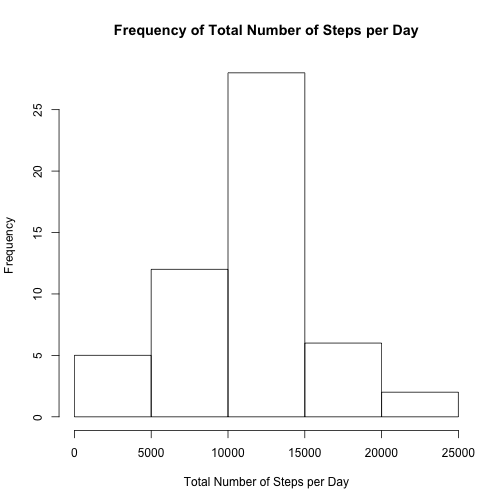
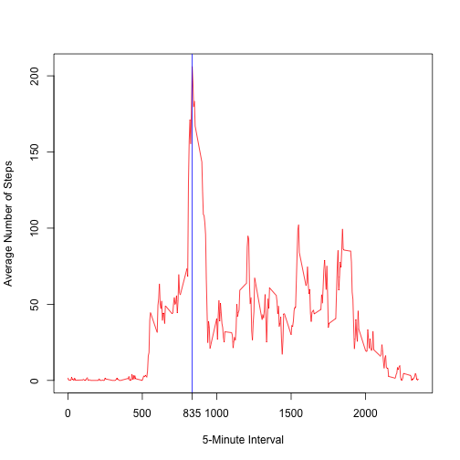
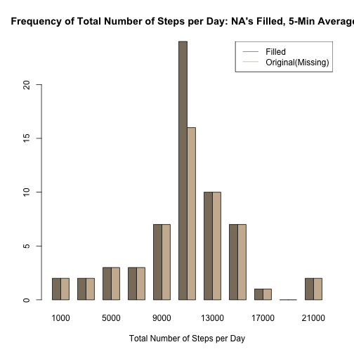
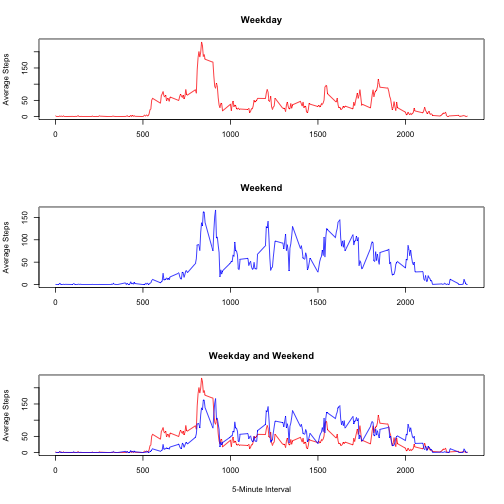

```r
---
title: "Personal Activity Monitoring Device Data"
author: "Aaron Kelly"
date: "9/6/2017"
output: html_document
---
```

```
## Error: <text>:8:0: unexpected end of input
## 6: ---
## 7: 
##   ^
```

  >
## Loading and Preprocessing the Data

In the code below, the data, located in the working directory as file, *activity.csv*, is loaded into a data.frame object in R, *activity*. 

```r
activity<-read.csv("activity.csv")
```
Now that the data has been loaded into R, it gets filtered to remove any rows that have NA's.  

```r
Activity<-na.omit(activity)
```

## Mean (and Median) Total Number of Steps per Day

### Total Number of Steps per Day

```r
Activity<-aggregate(Activity[,1],by=list(Activity[,2]),FUN=sum)
```
Now that the data has been aggregated, all the individual samples of steps have been added together if they occur on the same day.  For example, on 2012-10-05 the total number of steps that occured was 13294.

### Histogram of Total Number of Steps per Day

```r
hist(Activity[,2],main="Frequency of Total Number of Steps per Day",xlab="Total Number of Steps per Day")
```



### Mean of Total Number of Steps per Day

```r
dayMean<-mean(Activity[,2])
options(scipen=100)
```
The mean total number of steps per day is $\frac{10766.1886792 \ steps}{day}$.

### Median of Total Number of Steps per Day


```r
dayMedian<-median(Activity[,2])
```

The median total number of steps per day is $\frac{10765 \ steps}{day}$.

## Average Daily Activity Pattern

### Time Series Plot: Daily Average Number of Steps per 5-Minute Interval


```r
intervals<-aggregate(activity$steps,by=list(activity$interval),FUN=mean,na.rm=TRUE)
plot(intervals[,2]~intervals[,1],type="l",col="red",xlab="5-Minute Interval",ylab="Average Number of Steps")
abline(v=intervals[which.max(intervals$x),1],col="blue")
axis(1,at=intervals[which.max(intervals$x),1])
```



```r
max_x<-intervals[which.max(intervals$x),1]
max_y<-intervals[which.max(intervals$x),2]
```
As seen in the time-series plot above, the maximum number of steps per 5-minute interval, averaged across all days, was 206.1698113, which occured at the 835 minute interval.


## Inputing Missing Values

### Total Number of Missing Values (Rows with NA's)
Data collection is not complete.  We measure the incompleteness by measuring how many rows (observations) contain some "NA" value.  


```r
missingrows<-nrow(activity[is.na(activity[,1])|is.na(activity[,2])|is.na(activity[,3]),])
rows<-nrow(activity)
```

By way of the above code, we know that 2304 rows are missing measurements out of a total of 17568: $\frac{2304}{17568}*100 = percentage \ of \ missing \ rows$

### Filling in the Missing Values 
#### (with Average Steps per 5-Minute Interval)

By making the assumption that had the missing data been recorded, it would have measured close to the data that were measured near those times, we can reasonably fill them in and approximate analyses that could have resulted had the data been complete.  

First, we'll create a dataframe that has only the rows with missing values in them.


```r
missing<-activity[is.na(activity[,1])|is.na(activity[,2])|is.na(activity[,3]),]

notmissing<-activity[!is.na(activity[,1])&!is.na(activity[,2])&!is.na(activity[,3]),]
```

The above code effectively split the *activity* data frame into two smaller dataframes, *missing* and *notmissing*.


```r
colnames(intervals)<-c("interval","steps")
merged<-merge(missing,intervals,by.x="interval", by.y="interval")
```
By merging the *missing* dataframe with the *intervals* dataframe, we pair off all of the intervals that had "NA" steps with the average total number of steps for the same interval.

Next, we clean up the *merged* dataframe, by removing the column of NA's, and giving names that agree with the original, *activity* dataframe.

```r
merged<-cbind(merged[,1],merged[,3:4])
colnames(merged)<-c("interval","date","steps")

filled<-rbind(merged,notmissing)
```
This allowed us to paste back together the *merged* data frame with the *notmissing* dataframe, giving us a *filled* dataframe, which should be the same as the original, *activity*, except all of the NA's have been replaced with average 5-minute interval values.  

In conclusion, we see that the data representation with missing values differs from the data representation filling in those values at the median value, where the former has a value approximate to the mean, while the latter converges to the mean.

##### Graphing the Filled in Data

Now that we have filled in all the NA's, we can graph and see how this compares with the result when we just ignored the NA's


```r
library(plotrix)
filledDay<-aggregate(filled$steps,by=list(filled$date),FUN=sum)
compare<-list(filledDay[,2],Activity[,2])
multhist(compare,main="Frequency of Total Number of Steps per Day: NA's Filled, 5-Min Averages",xlab="Total Number of Steps per Day",col=c("bisque4","bisque3"))
legend("topright",c("Filled","Original(Missing)"),col=c("bisque4","bisque3"),lty=c(1,1))
```



##### Mean of Filled Data


```r
dayMeanFilled<-mean(filledDay[,2])
dayMedianFilled<-median(filledDay[,2])
```
After the NA's are filled with corresponding averages for 5-minute intervales, the **mean** is $\frac{10766.1886792 \ steps}{day}$, and the **median** is $\frac{10766.1886792 \ steps}{day}$, compared to the mean before filling NA's, $\frac{10766.1886792 \ steps}{day}$, and the median, $\frac{10765 \ steps}{day}$.

## Weekday versus Weekend Activity Patterns

### Creating the *Weekday* Column
In order to compare weekday versus weekend usage, we augment the data with a column that lets us know whether each observation was made on a weekday or a weekend.  

We accomplish this by first of all taking our data, *filled*, with the NA's filled in with the 5-minute interval averages, augmenting it with a copy of the "date" column, and renaming that copied column, "weekday".


```r
filledWeek<-cbind(filled,filled$date)
colnames(filledWeek)[4]<-"weekday"
```

Now, we apply the "weekdays()" function to convert each of the dates in the "weekday" column to a character string, "weekday" or "weekend", according to the date.


```r
filledWeek$weekday<-weekdays(as.Date(filledWeek$weekday))
```

Nextly, we use the "sub()" function to replace the day name with the category to which it belongs.


```r
filledWeek$weekday<-sub("Monday|Tuesday|Wednesday|Thursday|Friday","weekday",filledWeek$weekday)
filledWeek$weekday<-sub("Saturday|Sunday","weekend",filledWeek$weekday)
filledWeek$weekday<-as.factor(filledWeek$weekday)
```


### Comparing Graphically Weekday to Weekend Activity 


```r
filledWeekIntervals<-aggregate(filledWeek$steps,by=list(filledWeek$interval,filledWeek$weekday),FUN=mean)
filledWeekdayIntervals<-dplyr::filter(filledWeekIntervals,filledWeekIntervals$Group.2 == "weekday")
filledWeekendIntervals<-dplyr::filter(filledWeekIntervals,filledWeekIntervals$Group.2 == "weekend")
par(mfrow=c(3,1))
plot(filledWeekdayIntervals$x~filledWeekdayIntervals$Group.1,xlab="",type="l",main="Weekday",ylab="Average Steps",col="red")
plot(filledWeekendIntervals$x~filledWeekendIntervals$Group.1,xlab="",type="l",main="Weekend",ylab="Average Steps",col="blue")
plot(filledWeekdayIntervals$x~filledWeekdayIntervals$Group.1,type="l",main="Weekday and Weekend",ylab="Average Steps",col="red",xlab="5-Minute Interval")
lines(filledWeekendIntervals$x~filledWeekendIntervals$Group.1,type="l",col="blue",ylab="Average Steps")
```


```

